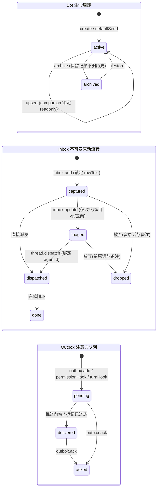

# FEAT-001 ~ FEAT-003 核心状态机图

```mermaid
stateDiagram-v2
    direction LR
    state "Bot 生命周期" as BotSM {
        [*] --> active : create / defaultSeed
        active --> active : upsert (companion 锁定 readonly)
        active --> archived : archive (保留记录不删历史)
        archived --> active : restore
    }

    state "Inbox 不可变原话流转" as InboxSM {
        [*] --> captured : inbox.add (锁定 rawText)
        captured --> triaged : inbox.update (仅改状态/目标/去向)
        triaged --> dispatched : thread.dispatch (绑定 agentId)
        captured --> dispatched : 直接派发
        dispatched --> done : 完成闭环
        captured --> dropped : 放弃(留原话与备注)
        triaged --> dropped : 放弃(留原话与备注)
    }

    state "Outbox 注意力队列" as OutboxSM {
        [*] --> pending : outbox.add / permissionHook / turnHook
        pending --> delivered : 推送前端 / 标记已送达
        delivered --> acked : outbox.ack
        pending --> acked : outbox.ack
    }
```

**明确禁止的非法跃迁**：
- `companion` 角色不可转为 `workspace` 或 `full` 沙盒权限；
- 任何更新操作均不得改写或清空 `InboxItem.rawText`；
- 已 `acked` 的 Outbox 条目不可逆退回 `pending`。
